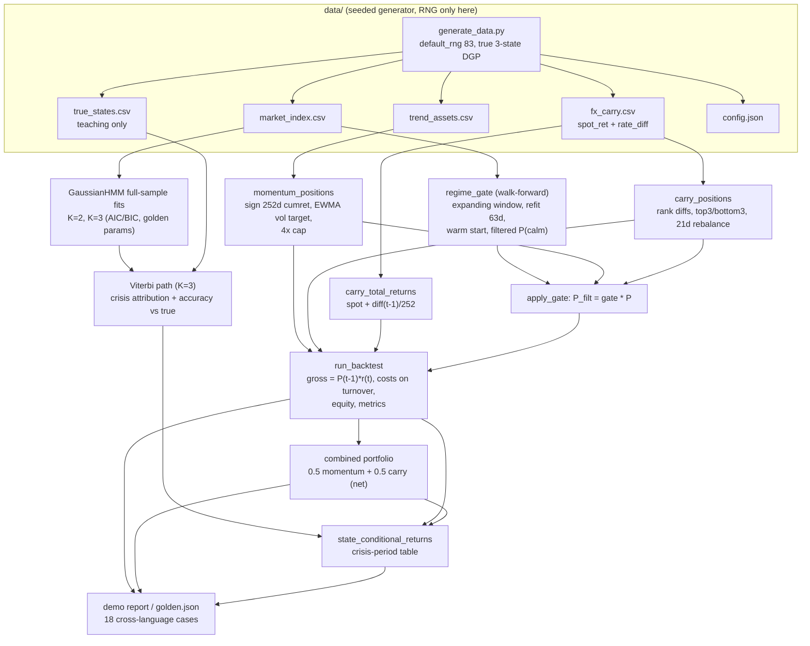
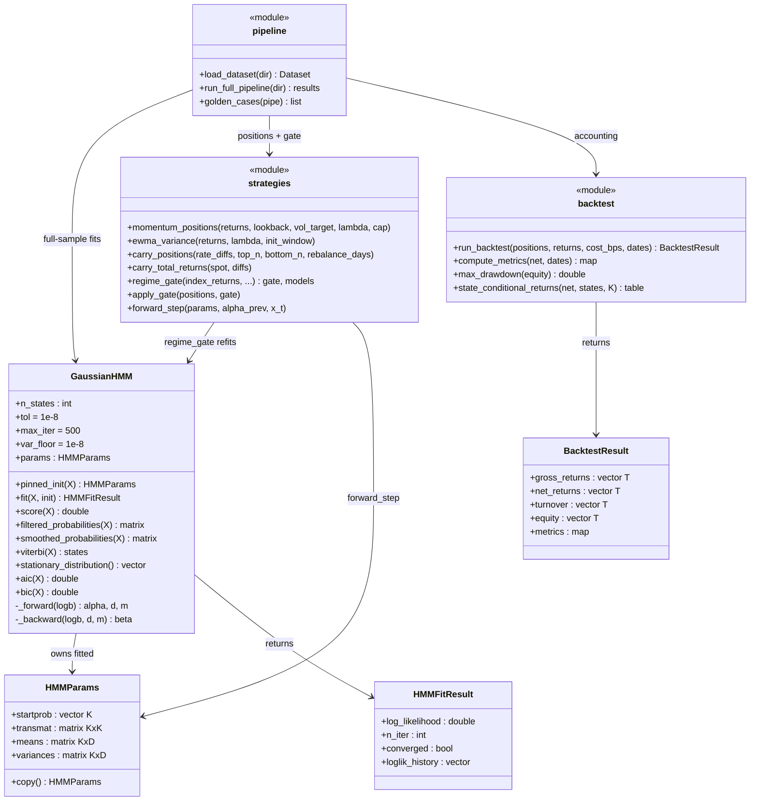

# ARCHITECTURE — regime toolkit

Design notes for the four parallel implementations (Python reference
`python/src/regime`, C++ `regime::`, Rust crate `regime`, Java
`com.quant.regime`). The normative cross-language contract is
[`../API_SPEC.md`](../API_SPEC.md); this document explains *why* the
pieces are shaped the way they are.

## 1. Components and responsibilities

| Component | Python module | Responsibility |
|---|---|---|
| HMM core | `hmm.py` | Diagonal-covariance Gaussian HMM: pinned init, scaled forward-backward, Baum-Welch EM, Viterbi, filtered/smoothed posteriors, stationary distribution, AIC/BIC. Plus `forward_step`, the single-observation filter update used by the gate. |
| Strategies | `strategies.py` | Position construction only — momentum (signal + EWMA vol targeting), carry (ranking + rebalance schedule + accrual), the walk-forward `regime_gate`, and `apply_gate`. Strategies never touch P&L. |
| Backtest engine | `backtest.py` | The one place accounting exists: gross/net/turnover/equity recursions, summary metrics, drawdown, state-conditional attribution. Every strategy runs through the same engine. |
| Pipeline | `pipeline.py` | Data loading, the end-to-end study (`run_full_pipeline`), and `golden_cases`. Demo, golden generator, and golden tests all call the same function, so they cannot drift apart. |
| Data generator | `data/generate_data.py` | The only RNG in the project (seeded, `default_rng(83)`). Simulates the true 3-state DGP, writes CSVs byte-for-byte reproducibly, self-validates (enumerated forward check, EM monotonicity), then writes `golden.json`. |

The separation is deliberate: **signals decide, the engine accounts**.
Strategy code emits a position matrix `P[t, a]` ("decided at the close of
day t") and nothing else; the engine alone maps positions to returns via
`gross[t] = sum_a P[t-1, a] * r[t, a]`. Lookahead bugs then have exactly
one place to hide, and one test (`test_no_lookahead_shift`) to catch them.

## 2. Data flow



Two distinct HMM uses coexist and must not be confused:

* **Full-sample fits** (K=2, K=3) feed model selection, the golden
  parameter cases, the Viterbi-vs-true teaching number, and the
  crisis-attribution table. These see the whole sample — legal because
  they never drive a position.
* **Walk-forward fits** inside `regime_gate` drive positions and see only
  the past: first fit after 504 observations, refits every 63 days on
  expanding windows, filtered (never smoothed) probabilities in between.

## 3. Component model



The walk-forward gate in detail — the one algorithmically subtle loop:

```mermaid
sequenceDiagram
    participant Loop as walk-forward loop (t = 503..1999)
    participant HMM as GaussianHMM
    participant FS as forward_step
    participant Gate as gate[t]

    Note over Loop: before t0 = 503 the gate is 1 (no model yet)

    Loop->>HMM: t = 503: fit(r[0..503]) from pinned quantile init
    HMM-->>Loop: params (label-sorted), k* = argmin variance
    Loop->>HMM: filtered_probabilities(r[0..503])
    HMM-->>Loop: alpha[503] (full scaled forward pass)
    Loop->>Gate: gate[503] = alpha[503][k*]

    loop each day t between refits
        Loop->>FS: forward_step(params, alpha[t-1], r[t])
        FS-->>Loop: alpha[t] (one O(K^2) update, no lookback)
        Loop->>Gate: gate[t] = alpha[t][k*] (or 1{p >= 0.5} in binary mode)
    end

    Loop->>HMM: t = 566, 629, ...: fit(r[0..t], init = previous params)
    Note right of HMM: warm start keeps labels stable<br/>and EM iterations few
    HMM-->>Loop: refreshed params, new k*, fresh full forward pass
```

## 4. Numerical design decisions and trade-offs

* **Scaled forward-backward, not log-space** (pinned). Rabiner scaling
  gives the log-likelihood as `sum(log d_t + m_t)` and the filtered
  probabilities as a by-product, and its E-step statistics
  (`gamma = alpha_hat * beta_hat`, `xi` with the shared `d_{t+1}`) need no
  further normalization. Log-space would call `log`/`exp` per state pair
  per step and make `xi` clumsy. Trade-off: scaling needs the extra
  per-step emission shift `m_t = max_i log b_t(i)` — without it, a single
  crisis-sized return under a calm state produces a density like
  `e^-139`, and a whole *row* of underflowing densities would make
  `d_t = 0`. With the shift, every scaled emission is in `(0, 1]` and the
  largest is exactly 1.
* **Deterministic everything.** Quantile-based init, fixed 0.9
  self-transition prior, no random restarts, ties pinned (Viterbi argmax
  toward lower index; carry ranking by `(-diff, index)` stable sort),
  label sort applied exactly once after EM. This trades a shot at
  marginally better local optima for bitwise Python reproducibility and
  1e-6..1e-8 cross-language golden agreement. Summation within a pass is
  left-to-right over time; the tolerances absorb vectorization rounding.
* **Variance floor (`1e-8`) every iteration** kills the Gaussian-mixture
  likelihood singularity and lets K exceed the data's distinct-value
  support without crashing. Trade-off: a floored state is a slightly
  biased fit — acceptable, since a floored state is degenerate anyway.
* **Convergence semantics**: the E-step *scores current parameters
  first*, so on convergence the reported log-likelihood matches the
  returned parameter set exactly (no trailing M-step). On `max_iter`
  exhaustion the parameters have had one extra M-step, so one extra
  E-step re-scores them — again keeping report and parameters consistent.
  Non-convergence is a flag, not an exception: walk-forward loops must
  survive a stubborn window.
* **Warm-started refits.** Each refit initializes from the previous
  label-sorted fit. This cuts EM iterations dramatically (the expanding
  window changes little in 63 days) and keeps state identities stable
  across refits; the calm state is nevertheless re-identified per model by
  `argmin variance` rather than trusted by label — walk-forward fits can
  reorganize.
* **Stationary distribution by power method** (pinned) rather than an
  eigen-solver: three lines, no linear-algebra dependency in the native
  ports, tolerance 1e-13 with a 10000-iteration cap, and the result is
  verified against `pi @ A = pi` at 1e-10 in tests.
* **Momentum via cumulative growth ratios**: the trailing cumulative
  return is `growth[t] / growth[t - lookback] - 1` on a running product —
  O(T) rather than O(T * lookback). EWMA variance is seeded with the mean
  squared return of the first window (zero-mean convention, pinned) so the
  recursion has a well-defined deterministic start.
* **Cost model**: linear bps on one-sided turnover, charged the day the
  trade is made (`net[0]` pays for building the initial book). Simple,
  pinned, and sufficient for the teaching point; market impact and
  bid/ask asymmetry are out of scope.

## 5. Error-handling strategy per language

The contract distinguishes **programming/input errors** (fail fast) from
**numerical outcomes** (report, never throw): bad shapes, NaN/inf, K < 2,
T <= K, series shorter than lookback, invalid config values are errors;
EM non-convergence, floored variances, and tied ranks are ordinary
results.

| Language | Input errors | Non-convergence |
|---|---|---|
| Python | `raise ValueError(message)` | `HMMFitResult.converged = False` |
| C++ | `throw std::invalid_argument` (`std::domain_error` for numeric-domain violations) | `HMMFitResult::converged == false` |
| Rust | `Err(RegimeError::...)` — a thiserror-style enum; no panics on bad input | `converged: false` in the fit result |
| Java | `throw IllegalArgumentException(message)` | `HmmFitResult.converged() == false` |

Validation happens at the public API boundary (`_as_2d`,
`_validate_returns`, constructor checks), so internal loops can assume
clean finite input and stay branch-free. Error messages carry the
offending value (`"T=10 <= lookback=252"`) because these surface in
walk-forward loops where context is otherwise lost.

## 6. Testing strategy

Four layers, mirrored in each language:

1. **Ground truth by enumeration.** On a tiny K=2, T=3 model the forward
   likelihood, smoothed marginals, and the Viterbi path are checked
   against brute-force sums over all 8 paths (tolerance 1e-12). This
   anchors the algebra independently of any implementation.
2. **Mathematical properties.** EM log-likelihood monotonicity on the
   bundled index (every iteration non-decreasing); transition rows sum to
   1 (1e-12); the stationary vector satisfies `pi P = pi` (1e-10); label
   ordering (means ascending); posteriors are valid distributions;
   `forward_step` chained over the sample equals the full forward pass; a
   grid-style property test that better-matched parameters score higher
   likelihoods; costs never help (property over a cost grid);
   the accounting identity; and the one-day-shift no-lookahead test.
3. **Golden values.** All 18 cases in `data/golden/golden.json` — HMM
   fit results at 1e-6/1e-5, probabilities at 1e-8, strategy metrics at
   1e-8, Viterbi counts exact — plus the baked-in sign/semantic cases
   (crisis momentum return < 0, filtered combined Sharpe > unfiltered,
   filtered momentum maxDD shallower but return lower). Every language
   parses the same flat JSON schema (C++ with a minimal hand-rolled
   reader, Rust with serde_json, Java with a small bundled parser) and
   must run the full pinned config for golden comparisons.
4. **Edge cases.** K=1 rejected; variance floor engages when K exceeds
   distinct data support; short series rejected; carry tie-break by
   index; rebalance window longer than the sample keeps the day-0 book;
   zero-cost path gives `net == gross` exactly; non-convergence is a
   flag; determinism (two fits are bitwise identical in Python).

The Python suite additionally cross-checks the K=3 fit against
`hmmlearn` when it is installed (skipped otherwise) — an independent
implementation agreeing on the bundled data is strong evidence the
reference itself is right, which matters because the reference produces
the golden file.

## 7. Performance notes

* Complexities: forward/backward `O(T K^2)` each, one EM iteration
  `O(T K^2 + T K D)`, Viterbi `O(T K^2)`, full walk-forward gate roughly
  `sum over refits of (iters * O(T_i K^2))` — kept small by warm starts
  (later refits typically converge in a handful of iterations vs 63 from
  cold).
* The full pinned pipeline (2 full-sample fits + 24 walk-forward refits +
  4 backtests) runs in a few seconds in Python/numpy on 2 CPUs; the
  native ports are comfortably faster. Test suites shorten walk-forward
  loops where the spec allows (`refit_days` override), but golden
  comparisons always run the pinned config.
* Python vectorizes over states and assets and loops only over time
  (the recursions are inherently sequential); the `xi` accumulator is a
  single `(K, K)` matrix built as `A * (alpha[:-1].T @ w)` instead of a
  `(T, K, K)` tensor — this keeps memory at `O(T K)`.
* Native ports should preallocate the `(T, K)` alpha/beta buffers and
  reuse them across EM iterations; none of the hot loops allocates.
* Determinism beats micro-optimization in this codebase: keep summation
  order left-to-right over time inside a pass. Reordered reductions
  (e.g. pairwise/BLAS-tree sums over *time*) can drift past golden
  tolerances after 500 EM iterations.
